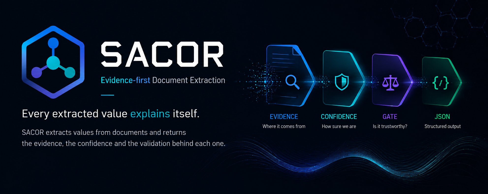

<p align="center">
  
</p>

<p align="center">
  <a href="https://github.com/vinsblack/sacor/actions/workflows/ci.yml"></a>
  <a href="https://pypi.org/project/sacor/"></a>
  <a href="https://pypi.org/project/sacor/"></a>
  <a href="LICENSE"></a>
  
</p>

# sacor

**Evidence-first Document Extraction.**

Extracting a value from a document is easy. Trusting it is hard.
sacor returns evidence, not only values — every field comes with
where it came from, what happened to it, and what it was checked
against.

```bash
pip install sacor
```

## Why

An extractor that returns `"total": "312.45"` is asking you to trust
it. An extractor that returns the value **and** the evidence behind it
lets you check.

```json
{
  "total": {
    "value": "312.45",
    "confidence": "alta",
    "evidence": {
      "origin": "tier0",
      "repair": [{"tipo": "ripara", "da": "312,45", "a": "312.45"}],
      "invariants": {"passed": 3, "failed": 0}
    }
  }
}
```

`origin` says a regex read it deterministically, not a model guessing.
`repair` says the raw text was normalized (Italian decimal comma →
dot) — traceable, not silent. `invariants` says three arithmetic
checks against sibling fields held. Confidence is not a number someone
picked — it's computed from this evidence (see below).

A field sacor couldn't find is `null`, not a plausible guess. That's
the whole bet: an extractor that says "I don't know" on the fields it
can't verify is worth more than one that's silently wrong.

## Quick start

```bash
pip install sacor
curl -sO https://raw.githubusercontent.com/vinsblack/sacor/master/examples/sample.pdf
sacor extract sample.pdf
```

`sample.pdf` is a synthetic bill ([`examples/`](examples/)) — no real
data, no setup, tier0 only. Expected output:
[`examples/sample-output.json`](examples/sample-output.json).

Tier0 (regex, deterministic) always runs, free. `--tier1` opts into
an AI pass (claude-opus-5) for fields tier0 couldn't resolve — real
API cost, `ANTHROPIC_API_KEY` required, needs the optional provider
dependency, never automatic:

```bash
pip install "sacor[providers]"
sacor extract sample.pdf --tier1
```

Full output shape and field-by-field evidence: see [Evidence
Model](#evidence-model) below, or the real example in
[`docs/06-documento-tecnico.md`](docs/06-documento-tecnico.md).

## Evidence Model

Every extracted field is a `value` plus an `evidence` object — never
just the value alone:

| Key | Answers |
|---|---|
| `origin` | Where did this come from — `tier0` (regex), `tier1` (AI), `derivato` (computed from other fields)? |
| `status` | If there's no value, why — not attempted, tried and failed, or genuinely not found? |
| `repair` | What transformation was applied to the raw text (date/number normalization)? |
| `derivation` | If computed, from which fields and which rule? |
| `invariants` | How many arithmetic/logical checks against sibling fields passed or failed? |

`confidence` (`alta`/`media`/`bassa`/`null`) is not stored — it's a
**pure function of evidence**: `alta` for a clean tier0 read, `media`
for AI or derived (inherits upstream uncertainty), `bassa` if any
invariant involving the field failed — regardless of origin. The Gate
(`pass`/`warning`/`reject`) is the same idea one level up: a pure
function that reads only evidence, nothing else.

Full contract, JSON shape, and the decisions behind it:
[`docs/02-decisions.md`](docs/02-decisions.md), ADR-056 onward.

## Architecture


AI is one step out of ten, opt-in, never automatic. Everything else is
deterministic Python — no arithmetic ever passes through a model.
Domain lives entirely in a YAML schema, not in code: a new document
type is a new schema file, not a new sprint. Details:
[`docs/01-architecture.md`](docs/01-architecture.md).

## Current status

**Pre-alpha. Do not use in production.**

Real accuracy (real corpus, 15 documents, tier0+tier1+derivation):
**68.7% per field, 13.3% per complete document.** Published in full —
weakest fields (`periodo_da`/`periodo_a` 33%, `kwh_f1` 53%) included,
not hidden. Full breakdown and every measurement attempt (including
failed ones): [`docs/02-decisions.md`](docs/02-decisions.md).

The Result/Evidence contract was verified — not just measured for
accuracy — on 39 real documents of a second, structurally different
document type (Italian pre-contractual utility offer sheets, CTE) it
was never designed against: **39/39, zero contract changes needed**.
[`docs/verification-report-v1.md`](docs/verification-report-v1.md).

## Schemas

Italian utility bills (electricity, gas) and pre-contractual offer
sheets (CTE) are the first schemas, not the destination. Any document
where values must be arithmetically checkable against each other fits
the model — see [`docs/00-north-star.md`](docs/00-north-star.md) for
what does and doesn't.

## Roadmap

Short version: PyPI package (done) → n8n node → stable API → external
users → new real-world cases feeding the corpus, in that order — not
"perfect accuracy first." Why, and the full history:
[`docs/04-roadmap.md`](docs/04-roadmap.md).

## FAQ

**Why not just ask an LLM to return JSON?** You can. What you get back
is a value with no way to check it — same failure mode as a human
guessing confidently. sacor's bet is that the verification layer
(regex-first, arithmetic invariants, evidence, a gate) is worth more
long-term than a better prompt, because it survives model changes: the
prompt-only approach's accuracy is tied to whichever model you called;
sacor's evidence model doesn't change when the underlying model does.

**Does it work well?** Not yet, not fully — see Current status above.
It's public because the contract is stable and the number is real, not
because the number is high.

## Contributing

See [`CONTRIBUTING.md`](CONTRIBUTING.md) — short version: measure
before claiming, no third-party documents in the repo, a new document
type is a new YAML schema, not new code.
[`CODE_OF_CONDUCT.md`](CODE_OF_CONDUCT.md) for behavior,
[`SECURITY.md`](SECURITY.md) to report a vulnerability.

## License

Apache-2.0. Citation: [`CITATION.cff`](CITATION.cff).
